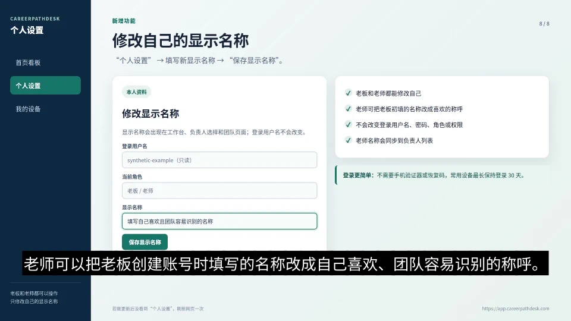
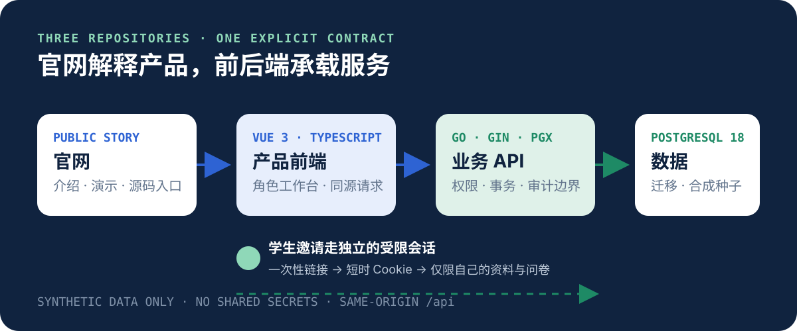

<p align="center">
  
</p>

<p align="center">
  <a href="https://confidence-huang.github.io/careerpathdesk-website/">在线官网</a> ·
  <a href="https://github.com/Confidence-huang/careerpathdesk-frontend">前端仓库</a> ·
  <a href="https://github.com/Confidence-huang/careerpathdesk-backend">后端仓库</a>
</p>

## 这是什么

CareerPathDesk 是一套围绕职业服务过程设计的工作台：老板看到团队与风险，老师管理学生与跟进，学生只通过受限邀请完成必要资料和测评。本仓库是项目官网，也是三个公共仓库的入口。

它强调的不是“多做几个页面”，而是把四段业务闭环放在同一条可审计链路里：

1. 建立学生档案与隐私事实；
2. 记录服务跟进与下一步；
3. 通过受限邀请收集测评；
4. 汇总团队统计、关注事项与最小审计证据。

## 真实演示

[](media/careerpathdesk-demo.mp4)

点击封面可直接打开约 3 分钟的中文演示视频。视频来自历史授权演示，使用示例资料；画面中出现的历史部署地址不代表当前仍提供对应线上服务。

## 三仓库结构



| 仓库 | 负责什么 | 技术边界 |
| --- | --- | --- |
| `careerpathdesk-website` | 品牌说明、产品叙事、演示入口 | 静态 HTML / CSS，无跟踪脚本 |
| `careerpathdesk-frontend` | 老板、老师、学生三类交互界面 | Vue 3 / TypeScript / Vite |
| `careerpathdesk-backend` | 权限、事务、审计、数据持久化 | Go / PostgreSQL / Docker Compose |

## 本地运行

```bash
git clone https://github.com/Confidence-huang/careerpathdesk-website.git
cd careerpathdesk-website
npm test
python3 -m http.server 4173
```

打开 `http://127.0.0.1:4173`。网站不依赖构建步骤、远程字体、统计 SDK 或第三方 JavaScript。

## 数据边界

公共仓库只包含合成数据入口、示例配置和授权演示素材，不包含生产数据库、真实学生资料、私钥、访问令牌、内部运行日志或历史部署配置。生产部署需要自行完成域名、密钥、备份与合规审查。

## 许可证

代码与仓库内原创素材采用 [GNU Affero General Public License v3.0](LICENSE)。第三方组件仍遵循各自许可证。
